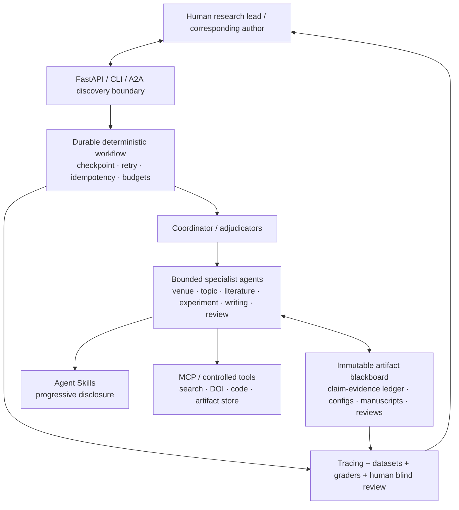

# 截至 2026-08-18 的架构结论

## 一句话答案

目前没有唯一的“最新多 Agent 架构”。本项目采用的 2026 推荐组合是：

> **可恢复的确定性状态图（控制面） + 有界 Agent 微循环（智能面） + 不可变 Artifact 黑板（数据面） + 并行专家 fan-out/fan-in（协作面） + 人工审批（治理面） + A2A/MCP/Agent Skills（互操作面） + Trace/Eval/单 Agent 基线（优化面）**

这比“Supervisor 让一群 Agent 自由聊天”更新、更稳定，也更能回答面试中的失败恢复、幂等、上下文污染、成本、权限、评测和人工介入问题。

## 为什么不选纯自治群聊

2026 年发表在 Nature 的 Robin 把文献搜索、假设、实验数据分析做成多 Agent 循环；研究者后来观察到工具几乎总按相同顺序调用，因而将流程改写成更稳定的确定性 Jupyter 工作流。该系统仍保留专职搜索/分析 Agent、多个独立分析轨迹、共识汇总和 human/lab-in-the-loop。这个结果直接支持本项目的混合控制策略：[Nature: A multi-agent system for automating scientific discovery](https://www.nature.com/articles/s41586-026-10652-y)。

OpenAI 官方也明确区分两类模式：handoff 适合专家接管会话，agents-as-tools 适合经理保持最终输出权；并建议只有在能力、策略、提示清晰度或 trace 可读性确实改善时才拆 Agent：[Orchestration and handoffs](https://developers.openai.com/api/docs/guides/agents/orchestration)。

## 五层架构

### 1. 控制面：确定性、可恢复的宏观图

研究周期可能持续数天或数月，不能把唯一状态放在一次模型对话里。每个 stage 完成后保存 checkpoint；并行任务只在 join 时统一提交；恢复后不重复已完成的实验或外部动作。

可替换的生产 runtime：

- LangGraph 强调 durable execution、persistence、human-in-the-loop 和故障恢复：[官方概览](https://docs.langchain.com/oss/python/langgraph/overview)、[Persistence](https://docs.langchain.com/oss/python/langgraph/persistence)。
- Microsoft Agent Framework 2026 的 workflow 使用图执行和 BSP superstep，Durable Extension 支持 checkpoint、跨进程恢复、长时间等待和 HITL：[Workflow execution](https://learn.microsoft.com/en-us/agent-framework/workflows/workflows)、[Durable Extension](https://learn.microsoft.com/en-us/agent-framework/integrations/durable-extension)。
- 本仓库 MVP 用 SQLite event/checkpoint store 自己实现最小控制面，便于面试时脱离框架解释；扩展到分布式部署时再替换 runtime。

### 2. 智能面：有界的 Agent 微循环

每个 Agent 只拥有完成本职任务所需的 Skill、工具和 artifact 视图，并设最大步数、超时、预算、重试和输出 schema。权限、截止规则、写操作和统计验收不交给模型自由决定。

OpenAI Responses API 的 Multi-agent 在 2026-08-18 仍是 GPT-5.6 的 beta，适合在一次请求中并行探索独立分支；官方也提示它不适合严格顺序、共享可变状态或确定性图。本项目把它定位为“阶段内可选加速器”，不作为唯一控制面：[Responses Multi-agent](https://developers.openai.com/api/docs/guides/responses-multi-agent)。

### 3. 数据面：Artifact 黑板，而非共享对话

Agent 传递的不是内部推理文本，而是版本化 artifact：

- 唯一 ID、类型、生产 Agent、stage、版本；
- 结构化内容和外部证据 URL；
- 置信度、时间戳、SHA-256；
- 只新增新版本，禁止覆盖历史证据。

上下文只加载当前任务需要的最近 artifact，降低串扰和 token 膨胀。完整 trace 用于审计，不强塞进每个 Agent 的 prompt。

### 4. 互操作面：A2A + MCP + Skills

- **A2A 1.0**：用于跨进程、跨团队、跨框架的独立 Agent；它提供 Agent Card、Task、Message、Artifact、streaming 和长期任务状态。最新发布规范为 1.0.0：[A2A 规范](https://a2a-protocol.org/latest/specification)。本 MVP 只实现 discovery card，未冒充完整 A2A server。
- **MCP 2025-11-25 规范**：用于 Agent 到工具/数据的资源、prompt 和 tool 访问；权限、用户同意和工具信任必须由 host 控制：[MCP 规范](https://modelcontextprotocol.io/specification/2025-11-25)。
- **Agent Skills**：目录包含 `SKILL.md`，可携带脚本、参考和资产；通过 discovery → activation → execution 渐进加载：[开放规范概览](https://agentskills.io/home)、[OpenAI Skills](https://developers.openai.com/api/docs/guides/tools-skills)。

A2A 不替代内部函数调用，MCP 不替代 Agent 协作，Skill 也不等于可执行工具。三者分别解决远程 Agent、外部能力、可复用流程知识。

### 5. 评测面：先 trace，再固定数据集

每个版本保留相同测试集，分别评估路由、检索、引用、实验、写作、审稿缺陷召回、端到端成功率、P95、token 和成本。先用 trace 找失败层，再用 dataset/eval 做回归；OpenAI 官方建议同样从 trace grading 进入可重复 eval：[Evaluate agent workflows](https://developers.openai.com/api/docs/guides/agent-evals)。

## 已登录浏览器执行层：Ego Browser

[ego (lite)](https://github.com/citrolabs/ego-lite) 的 `ego-browser` Skill 面向 Codex/Claude Code 等 Agent，能复用用户浏览器的登录状态，并把每个 Agent 任务放进隔离 Space；官方当前说明只支持 macOS，Windows/Linux 在路线图中。[官方 Skill 文档](https://lite.ego.app/document/en/docs/skills) 也明确强调登录状态复用、Agent Space 和用户可接管能力。

本系统把它放在 MCP/工具层后面的 `authenticated_browser` 适配器中，服务于三类任务：

1. 登录后的学术数据库检索与用户有权访问的全文下载；
2. 最新期刊/会议规则核验和投稿门户表单；
3. 外部审稿后的文件替换、回复上传和状态查询。

macOS 生产配置优先 `ego-lite`；当前 Windows 开发机映射到已有登录状态的 Chrome control，或加密的 persistent-profile browser。Agent 永远不接收密码或 cookie 文本；域名 allowlist、profile alias、并行 Space、下载哈希、外部副作用审批和 receipt 验证由控制面管理。CAPTCHA、MFA、付款、条款变化、越权下载仍属于 human takeover，而不是尝试规避。

## 科研工作流吸收的 2026 进展

- **PaperOrchestra（2026-04）**：把非结构化研究材料转为含文献综合、LaTeX 和图的投稿稿件，并发布 PaperWritingBench。说明“写作 Agent”必须消费真实 pre-writing artifacts，而不是从一句题目写整篇：[arXiv](https://arxiv.org/abs/2604.05018)。
- **Robin（Nature 2026）**：专职浅/深文献 Agent、实验分析 Agent、多轨迹共识、人类实验闭环和架构消融；同时揭示确定性工作流的重要性。
- **Agent Skills 生态（2026）**：格式快速普及，但社区 Skill 没有中央可信注册和强类型验证。因此 Nature Skills 可以作为可选的写作/图表 SOP，不能当官方期刊政策，也不能未经审计自动执行脚本。

## Nature Skills 的处理

用户所说的 “natural skills” 很可能是社区的 **Nature Skills**。本项目在 `config/external_skills.yaml` 登记两个候选仓库，但默认不自动安装：

- [Yuan1z0825/nature-skills](https://github.com/Yuan1z0825/nature-skills)
- [Boom5426/Nature-Paper-Skills](https://github.com/Boom5426/Nature-Paper-Skills)

安装前必须锁 commit、查许可证、审阅所有脚本和网络/文件权限。即使启用，官方期刊规则、作者原始证据和人工判断永远优先。

## 技术选型结论

| 层 | MVP | 生产可替换项 | 选择理由 |
|---|---|---|---|
| API | FastAPI 0.141.x | 现有 Django/Java 服务 | 异步、类型契约、OpenAPI |
| 契约 | Pydantic 2.13.x | protobuf/JSON Schema | 强校验且易演示 |
| 状态 | SQLite WAL + event log | Postgres + durable runtime | MVP 可运行、可检查点 |
| 模型 | mock / OpenAI Responses | 多模型路由 | 测试不依赖密钥，真实模式可替换 |
| 并发 | `asyncio.gather` | queue/workers | 只并行独立任务 |
| Agent 互操作 | A2A discovery boundary | A2A 1.0 server/SDK | 避免把内部每个函数都服务化 |
| 工具 | 受控 adapters | MCP servers | 先少而清晰，再扩生态 |
| Skills | 项目内开放格式 | 审计后的 Nature Skills | 按需加载、可版本控制 |
| 评测 | pytest + trace/event | trace graders + blind human eval | 不伪造质量指标 |
