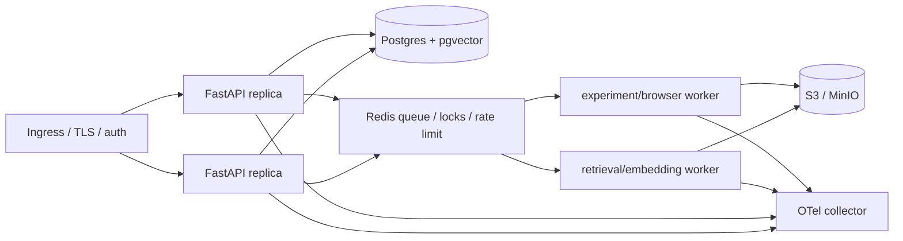

# 部署、可观测与回滚设计

## 当前可验证边界

V2 提供非 root `Dockerfile`、healthcheck、持久化 SQLite volume 和单实例 `compose.yaml`。它用于验证容器化 FastAPI/mock 流程，不冒充已是分布式生产部署。

```powershell
docker compose up --build
Invoke-RestMethod http://localhost:8000/health
```

## 生产目标拓扑



API process 只做验证、建 run、查状态、流式事件和审批；PDF 解析、embedding、重排、实验、浏览器和长模型任务进 worker。Postgres 是 run/checkpoint/artifact metadata 真相源；Redis 不是唯一持久状态源。

## SLO 必须在压测后确定

不在无流量数据时预先写“99.9% 可用”。需要至少记录：

- API P50/P95/P99、错误率、SSE 断线恢复；
- queue depth、worker wait/runtime、retry/dead-letter；
- model/retrieval/tool/browser 各子段 P95；
- checkpoint write/read 时延与 resume success；
- token/cost 预算中止次数；
- ACL denial、审批等待、人工接管和副作用去重指标。

## 日志与 trace

统一关联字段：`request_id / trace_id / run_id / task_id / stage_id / agent_id / tool_call_id / artifact_id / workflow_version / prompt_version / skill_version / model`。

不记录：密码、cookie、Authorization header、API key、全量私密 PDF 正文、模型隐藏推理。对人工审核必须保留的内容，只保存 artifact ID、摘要、安全位置和访问审计。

## 发布策略

1. CI：类型/格式、单元、契约、故障注入、Skill 校验、依赖/镜像扫描。
2. Offline eval：固定 dataset，与当前生产 workflow/model/prompt 比较。
3. Shadow：新版本不产生外部写入，对比 artifacts/traces。
4. Canary：按 run ID 稳定分流，低风险读任务先扩量。
5. 写副作用最后放量，且必须过 idempotency/receipt/人工 gate。

## 回滚

workflow、prompt、skill、model 和 tool schema 都有独立版本。回滚只对新 run 改变路由；已经运行的 run 继续使用它创建时锁定的版本，避免中途更换 graph/prompt 产生无法重放的混合状态。
