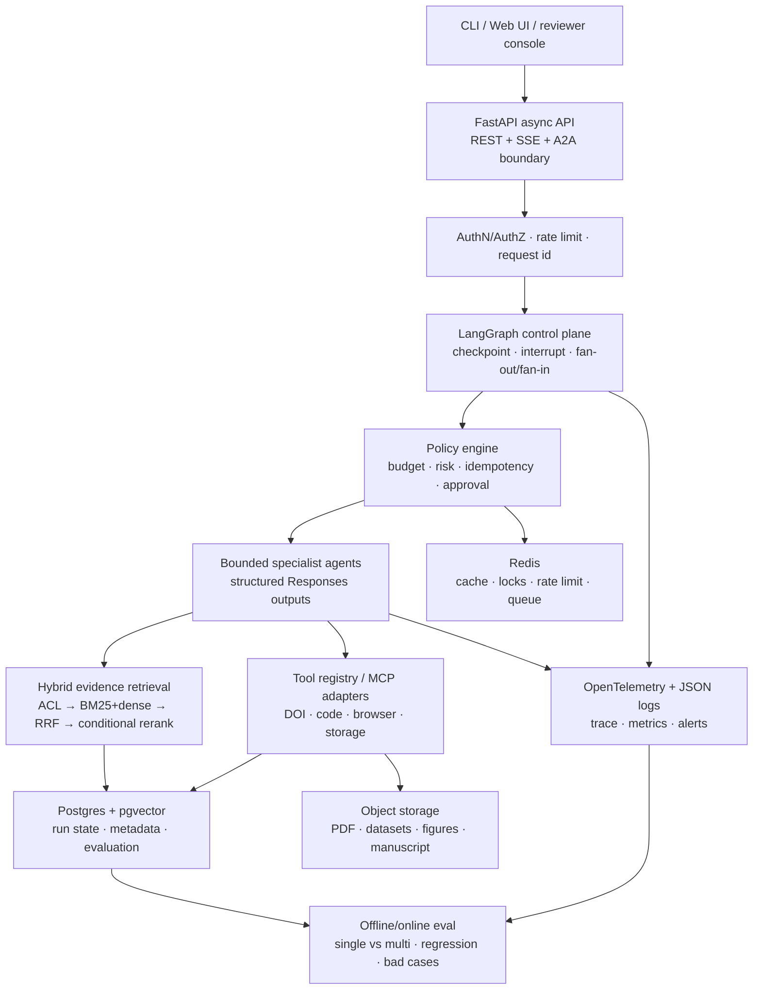
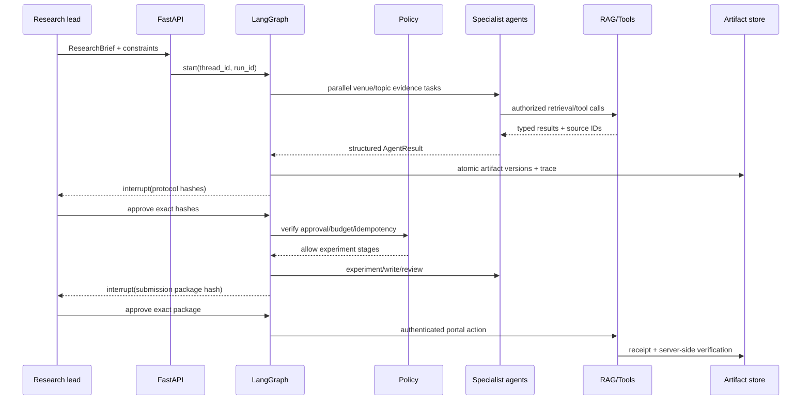

# V2 Long Draft：从最小闭环到生产级思考

## 1. 先定义问题，再谈框架

业务目标不是“使用更多 Agent”，而是让一个可能持续数周的论文项目在多次外部检索、实验、人工审批和审稿返修之间仍然可恢复、可追溯、不重复副作用。

首要风险依次是：

1. 假引用、过期投稿规则或无证据的结论；
2. 进程重启后重复实验、重复下载或重复投稿；
3. 写作者与评审者共享相同偏差，多 Agent 变成多份相同意见；
4. 长上下文、工具列表和重复搜索使成本与 P95 失控；
5. 文献库、数据、浏览器登录态和投稿权限被扩散到不需要的 Agent。

因此 V2 的约束是：确定性代码决定边界、权限、状态与副作用；模型只处理需要语义判断的部分。

## 2. V1 为什么故意不用大框架

V1 使用标准 Python + `asyncio` + SQLite，因为首先要证明的是 state、artifact、fan-out/fan-in、gate 和 revision loop 本身。如果第一版就依赖黑盒框架，面试时很难说清检查点何时写入、为什么不会重复提交、并行结果如何稳定合并。

V1 的局限也很明确：单进程循环与自建 checkpoint 会逐渐复制成熟 runtime 的能力，当节点数量、人工中断、分支和观测需求增长时，维护成本会迅速上升。这是 V2 引入工作流 runtime 的真实触发条件。

## 3. V2 目标架构

### 3.1 API 层

选 FastAPI，不是因为它“绝对最快”，而是这个服务的等待时间主要在模型、检索、浏览器和对象存储 I/O；FastAPI 的 async、Pydantic、DI、OpenAPI 和 SSE 与需求直接匹配。如果现有系统已经是 Django，应先评估复用其认证、ORM 和后台的收益，不为了 FastAPI 硬拆微服务。

### 3.2 控制面

选 LangGraph，因为其低层 StateGraph、checkpoint、interrupt、pending writes recovery 和 subgraph 能直接表达当前拓扑。应用仍自己定义 `RunState` 和 artifact 契约，不把业务状态绑死在框架 message history 里。

对比结论：

- Microsoft Agent Framework Durable Extension 在 Azure/Durable Task、跨进程恢复和可靠流式返回方面更完整，但当前作品集需要轻量 Python 自托管与快速解释；如果公司主要在 Azure/.NET，会重新评估。
- Temporal 适合分布式长任务与强可靠 activity，但现阶段引入它会与 Agent graph 形成两套调度语义。当出现跨月流程、多区域 worker 或严格 SLA 再引入。
- AutoGen/CrewAI 适合快速构建对话式团队或探索性协作，但本项目的主要风险是重复副作用、长期恢复和权限边界，因此不选群聊作为核心抽象。

### 3.3 模型层

直接使用 OpenAI Responses SDK 而不强制经过 LangChain model wrapper。理由是可以第一时间使用结构化输出、persisted reasoning、显式 prompt cache、Programmatic Tool Calling 和 Multi-agent beta。上层只依赖 `ModelGateway` Protocol，所以仍能接入其他模型或私有化 provider。

路由策略：

- 高容量分类、格式检查用成本型模型；
- 文献综合、方法审查用平衡型模型；
- 只对疑难仲裁、高价值审稿启用高 reasoning/pro mode；
- 每次升级必须在同一 eval set 上比较质量、时延、token 与成本，不因为“更新”默认更好。

### 3.4 RAG 层

不从“买哪个向量库”开始，而是从失败层开始：

1. ingestion：PDF/HTML/DOCX 解析，保留标题、页码、表格、公式、版本、来源和 ACL；
2. chunking：优先语义边界与父子文档，固定长度只是 fallback；
3. candidate retrieval：先做权限和版本过滤，再并行 BM25 与 dense retrieval；
4. fusion：RRF 不依赖两种分数处于相同量纲，适合第一个可解释基线；
5. rerank：只在 query 含混、候选多或高价值评审时启用 cross-encoder，避免所有请求都付出 P95；
6. generation：写作 Agent 只能引用 evidence ledger ID，无支持或冲突证据必须拒答/标注；
7. evaluation：路由、召回、重排、生成分层测，不用最终答案分数反推“向量库不好”。

本地版先使用可插拔的 sparse/dense Protocol 和确定性 RRF；生产默认 Postgres + pgvector，因为 run metadata、ACL、版本和向量可以使用同一事务边界。只有在数据量/QPS/索引测试证明单库无法满足时，才切换 Milvus/Weaviate 等专用向量库。

### 3.5 Agent 与协作层

30 个角色是“可选的专业边界”，不表示每个 run 都要调用 30 次模型。Coordinator 根据任务包、风险和预算剪枝：

- 必须独立并行：多源检索、彼此无依赖的专家评审；
- 必须顺序：研究设计 → 审批 → 实验 → 统计；
- 适合 agents-as-tools：中央 Coordinator 需要保留最终责任与统一输出；
- 适合 handoff：需要某个专家直接与人交互或具有独立权限域；
- 不需要 Agent：schema 校验、哈希、权限、截止日期比较、统计计算与最终副作用。

OpenAI Multi-agent beta 只用于单阶段内可清晰拆分的并行工作；共享可变状态、严格顺序、跨天等待和外部副作用仍由应用控制面管理。

### 3.6 工具与安全

每个工具都必须声明：输入/输出 schema、超时、重试条件、幂等键、风险级别、需要的主体/权限、数据敏感级别、是否会外部写入和人工审批 gate。

MCP 只在工具需要跨客户端/跨团队复用时引入；两三个内部 API 保留普通 Function Calling，避免工具列表和运维面无必要扩大。Skills 是 SOP，不是权限或 sandbox；外部 Skill 必须审计脚本、许可证和网络权限。

### 3.7 数据与部署

- Postgres：业务状态、checkpoint、artifact metadata、ACL、评测记录；
- pgvector：中小规模 dense index，与 ACL/版本过滤共用事务；
- Redis：限流、短缓存、分布式锁和 worker queue，不做唯一状态源；
- S3/MinIO：PDF、数据集、原始实验结果、图和稿件；
- worker：文桮解析、embedding、重排、实验和长时浏览器任务不占用 API process；
- Docker Compose：本地集成验证；Kubernetes 只在并发和组织基础设施需要时使用。

## 4. 典型请求的数据流

## 5. 故障设计与回退

| 故障 | 层级 | 处理 | 不做什么 |
|---|---|---|---|
| 模型 429/5xx | model gateway | 有界退避，记录 attempt，可路由到备用模型 | 无限重试 |
| 向量库不可用 | retrieval | 尝试 BM25-only，降低置信并标明降级 | 在无证据时自由回答 |
| 文献元数据冲突 | evidence | quarantine，请求人工或官方来源裁决 | 按检索排名自动选一个 |
| Agent 重复工具调用 | policy | call fingerprint + max repetition + circuit break | 继续 ReAct 直到 token 用完 |
| worker 在提交后崩溃 | side effect | 使用 idempotency key 查 receipt，不盲目再提交 | 根据本地超时判断“未提交” |
| CAPTCHA/MFA/条款变化 | browser | durable interrupt + human takeover | 绕过验证或默认同意 |
| 评审循环不收敛 | workflow | max rounds + blocker list + human risk acceptance | 为达阈值伪造实验 |

## 6. 从 V1 到 V2 如何证明是优化

V2 不以代码行数、Agent 数量或框架名称作为成功标准。必须在同一数据集上至少比较：

- V1 native workflow + single agent baseline；
- V2 LangGraph + single agent tools；
- V2 受控 multi-agent；
- 可选 OpenAI request-scoped multi-agent 阶段加速。

主指标是端到端任务成功率和 blocker defect recall；其次是引用正确率、检索 Recall@K/NDCG、工具选择/参数正确率、恢复后副作用重复率、P95、token 和成本。如果多 Agent 只提升成本与时延，则删除对应分工。

## 7. 实现边界

V2 Long Draft 会实现可本地测试的 RRF、权限过滤、工具超时/重试/幂等、budget、trace 和 A/B 报告基础契约；LangGraph、Postgres、Redis、OpenTelemetry exporter 和真实 browser provider 作为可插拔集成层。未获得真实账号、语料和部署环境前，不将 scaffolded 写成 production-ready。
