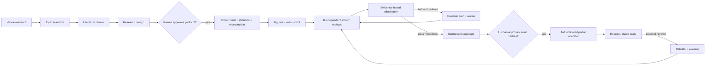

# 完整流程与每个子 Agent 的内部步骤

## 所有 Agent 共享的八步微循环

每个 Agent 都必须执行以下流程，区别只在于专业 rubric、允许工具和输出 artifact：

1. **契约校验**：检查 `run_id / task_id / stage / artifact_ids / revision_round`，拒绝过期或跨项目输入。
2. **按需加载 Skill**：先只看 skill 名称和描述，匹配后再读取完整 `SKILL.md`；不把所有技能常驻上下文。
3. **构建最小上下文**：按 ID 拉取本任务需要的不可变 artifact，不继承其他 Agent 的隐藏推理。
4. **制定有界计划**：声明目标、允许工具、最大步骤、预算、停止条件和需人工介入的事件。
5. **执行工具**：参数 schema 校验、权限检查、超时、有限重试、幂等键；浏览器任务先申请 profile/域名 lease。
6. **验证结果**：核对稳定标识符、来源、文件哈希、数值/引用/页面状态；不能验证就明确失败。
7. **自检**：检查是否越过证据边界、遗漏冲突、重复调用或违反投稿/伦理规则。
8. **提交 artifact**：只返回结构化输出、引用和置信度；编排器原子提交版本并写 trace。

## 宏观状态流

## 逐 Agent 流程

### A. 投稿目标

#### `journal_scout`

发现候选期刊 → 逐个打开出版社/期刊官网 → 存 scope 与文章类型 → 核验篇幅、费用、OA、数据/代码、AI/伦理披露和时间 → 保存 URL 与日期快照 → 输出候选；登录墙后的作者指南可走 `authenticated_browser`，不得用二手博客代替官网。

#### `conference_scout`

发现会议/track → 绑定具体年份 → 核验 CFP、页数、匿名、双投、artifact、rebuttal、时区 → 检查日期是否过期/冲突 → 输出候选和未知项。

#### `competition_scout`

发现比赛 → 核验主办方、资格、赛题、许可、提交物、评分、队伍限制和截止 → 标记训练数据/榜单泄漏风险 → 输出候选。

#### `venue_adjudicator`

读取三路候选 → 先淘汰违反硬约束者 → 按预先声明的 fit/time/cost/risk/audience 权重评分 → 做敏感性分析 → 输出首选、备选和需人工核验字段。它没有浏览器工具，不能补造事实。

### B. 选题

#### `novelty_scout`

把主题拆成查询族 → 搜近年/相邻领域 → 找最接近工作 → 写“已有能力—缺口—可区分实验” → 主动寻找会否定 novelty 的论文 → 输出可证伪创新性判断。

#### `feasibility_scout`

列数据、算力、时间、基线、代码、伦理和依赖 → 验证可获得性与许可 → 估算最小实验 → 列阻塞风险和退出条件 → 输出可行性评分。

#### `impact_scout`

定义受益读者/场景 → 对照 venue scope → 检查问题是否有实际或学术价值 → 区分影响、热度和夸大 → 输出影响路径及风险。

#### `topic_adjudicator`

读取三份独立判断 → 使用固定权重而非临时偏好 → 对硬约束一票否决 → 输出研究问题、假设、最小成功标准、淘汰题目及理由。

### C. 文献与证据

#### `semantic_librarian`

制定布尔/语义查询 → 在开放数据库和已授权登录数据库检索 → 保存查询日志 → 规范 DOI/标识符 → 初筛与去重 → 输出候选证据集。Ego Browser 在 macOS 可复用预登录状态并用独立 Space 下载用户有权访问的全文。

#### `citation_graph_librarian`

选择种子论文 → 后向追参考文献 → 前向追引用论文 → 找方法谱系和关键转折 → 标出版次/撤稿/更正 → 输出图谱证据集。

#### `prior_art_skeptic`

围绕 novelty claim 写反向查询 → 找更早、相邻、负结果、失败复现和矛盾工作 → 对每条 claim 给挑战证据 → 输出“为何可能不新/不成立”。

#### `evidence_synthesizer`

合并三路记录 → DOI/标题去重 → 核验元数据 → 区分同行评审与预印本 → 原子化 claim → 建 supports/contradicts/context 矩阵 → 隔离不可核验引用 → 输出 evidence ledger 与检索覆盖限制。

### D. 设计、实验和分析

#### `research_designer`

从选题和证据形成假设 → 定义主要/次要指标 → 选择基线、对照、消融、样本量、统计检验 → 定义数据/伦理/算力/停止规则 → 注册 artifact 契约 → 输出 protocol，等待人工批准。

#### `experiment_runner`

校验批准记录和 protocol 哈希 → 建隔离环境 → 锁依赖/数据/seed/config → 执行并记录所有 trial → 超时有限重试且不重复副作用 → 保存原始输出/日志/失败 → 输出 experiment bundle。

#### `statistician`

读取原始而非论文摘要结果 → 检查样本与缺失 → 重算指标/效应量/区间/检验 → 处理多重比较与稳健性 → 核对图表数值 → 输出统计报告和可报告范围。

#### `reproducibility_engineer`

从干净环境安装 → 用锁定输入复跑关键结果 → 比较哈希/容差 → 检查数据谱系、随机性和隐藏手工步骤 → 输出通过、失败和最小复现命令。

### E. 图与写作

#### `figure_designer`

把主要 claim 映射到图/表 → 选择合适视觉编码 → 从结果 artifact 生成而非手填数据 → 加不确定性、样本数、单位和可访问配色 → 生成 caption/数据映射 → 输出 figure plan/文件。

#### `manuscript_writer`

加载 venue 快照、ledger、protocol、结果、统计、复现和图 → 先做 claim outline → 分章节写作 → 每个数字/引用反向解析到 artifact → 检查 overclaim、限制和一致性 → 输出 manuscript 与 claim-evidence audit。Nature 目标可在审计后叠加 `nature-*` Skill，但不能改变证据。

### F. 六路独立专家评审

#### `methodology_reviewer`

只看设计与方法 rubric → 检查假设、对照、消融、泄漏、因果边界和方法披露 → 每条意见定位到稿件/artifact → 输出严重度和可验证修复。

#### `statistics_reviewer`

复算关键统计 → 查样本量、效应量、区间、多重比较、稳健性和图表一致性 → 输出统计缺陷；不能只凭语言流畅度打分。

#### `novelty_reviewer`

从稿件 novelty claim 生成独立检索 → 查近期/相邻 prior art → 验证引用 → 判断增量是否被实验隔离 → 输出新颖性风险。

#### `ethics_reviewer`

检查伦理审批、同意、许可、隐私、双重用途、作者/AI 使用披露、数据和图像完整性 → blocker 不得被平均分掩盖。

#### `reproducibility_reviewer`

核对代码/数据声明、依赖、seed、命令、环境、artifact 和独立复跑 → 尝试最小复现 → 输出复现缺口。

#### `venue_reviewer`

重新打开保存的官方规则 → 检查 scope、格式、匿名、长度、声明、补充文件和引用样式 → 规则已变化则要求重新审批。

#### `review_adjudicator`

在独立评审全部完成后读取报告 → 合并重复项 → 保留少数 blocker → 对冲突按证据仲裁 → 输出排序问题、综合分和 `pass/revise`；不能简单多数票。

### G. 修改、回复与投稿

#### `revision_planner`

逐条复制意见并编号 → 分类 → 决定修改/补证据/补实验/解释/有证据异议 → 建 comment-action-location-validation 矩阵 → 标成本和审批需求 → 输出 revision plan。

#### `manuscript_reviser`

只执行已批准矩阵 → 修改稿件/图/分析 → 记录 before/after 与 artifact 哈希 → 更新引用/数值/交叉引用 → 保留未解决项 → 输出 revised manuscript，回到六路复审。

#### `rebuttal_writer`

逐条引用外部意见 → 先直接回答 → 说明行动和证据 → 给精确页/行/节 → 对不同意项给可核验理由 → 不把未执行实验写成已完成 → 输出 rebuttal。

#### `submission_packager`

冻结通过复审的 manuscript → 生成稿件、补充材料、cover letter、数据/代码/AI/利益声明 → 校验文件和哈希 → 输出待批准 package；不操作门户。

#### `portal_operator`

读取针对 package 哈希的 `submission` 人工批准 → 申请 `venue-portals` 浏览器 lease → macOS 选 Ego Browser Space，Windows 选 Chrome fallback → 核验账号/venue/year → 填表并上传 → 预览复核 → 仅在批准仍有效时提交 → 获取 receipt 并验证服务端状态。验证码、MFA、付款、条款变化或文件哈希变化立即暂停。

## Ego Browser 接入点

Ego (lite) 官方资料说明它目前仅支持 macOS，可迁移现有 Chrome 登录状态，并为 Agent 创建互不干扰、可并行的 Spaces；`ego-browser` skill 暴露 snapshot、navigate、fill、click、wait、capture/JS 等能力：[项目](https://github.com/citrolabs/ego-lite)、[官方 Skills 文档](https://lite.ego.app/document/en/docs/skills)。

本项目的 Windows 开发环境不会假装运行 Ego。`config/browser_providers.yaml` 将相同的 `authenticated_browser` 契约映射到当前平台 provider；迁移到 Mac 后，域名 allowlist 和 profile alias 不变，只替换执行器。

